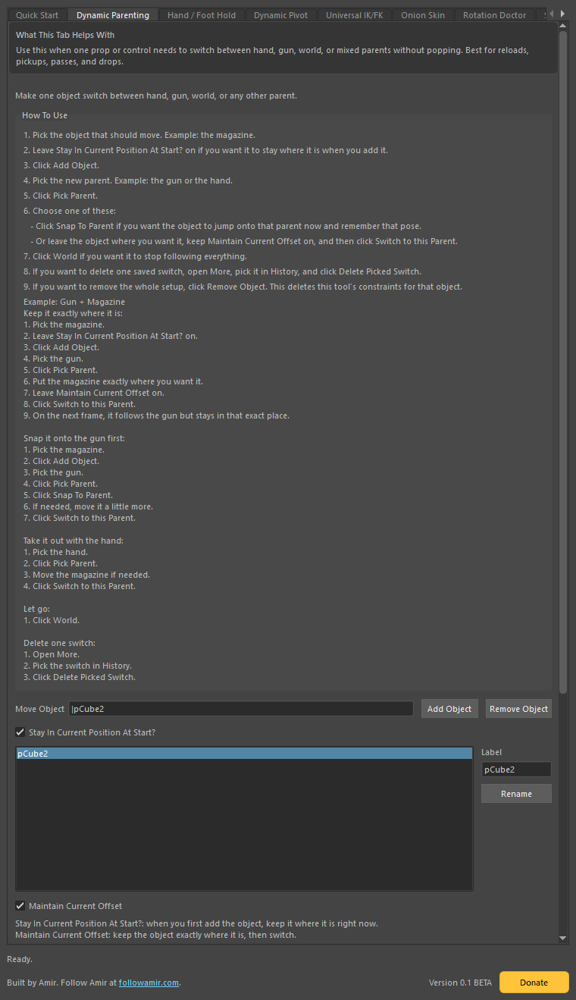
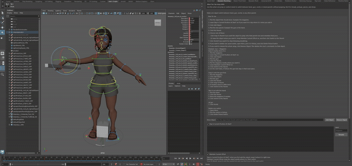
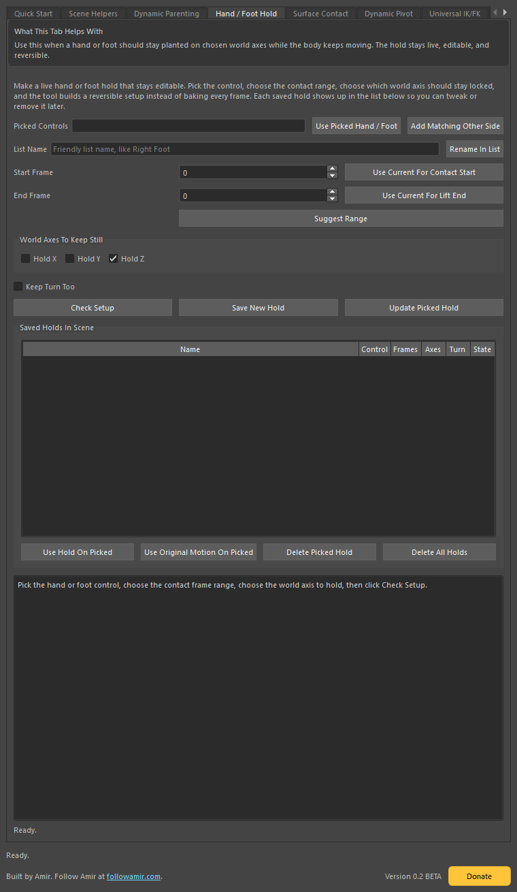
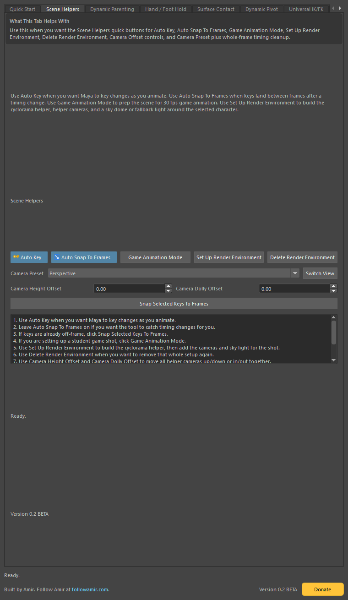
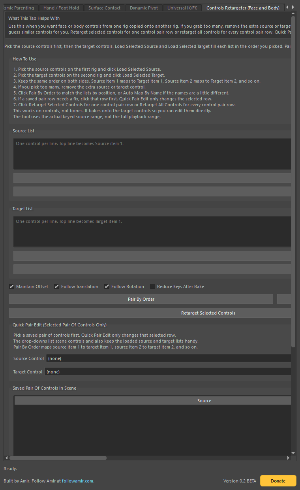
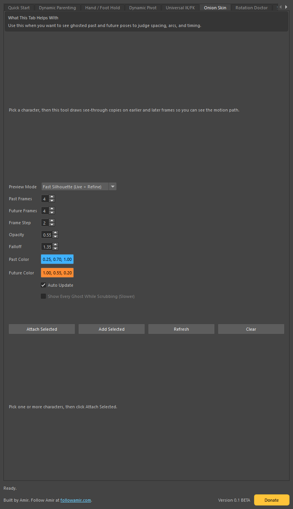
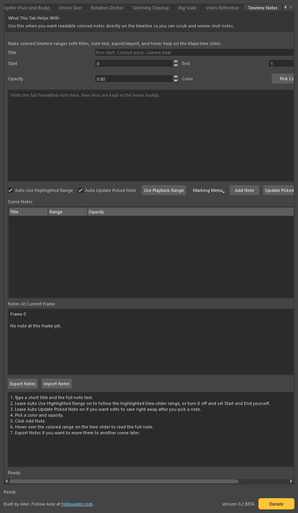

# Maya Anim Workflow Tools

By Amir Mansaray

A tabbed Maya toolset for animation workflow helpers.

`Version 0.2.1 BETA`

## Sections In Use

The sections in regular use in this beta are:

- `Scene Helpers` for quick shot setup: the cyclorama, helper cameras, camera presets, and basic scene prep
- `Controls Retargeter (Face and Body)` for retargeting motion between controls, skeletons, or skeleton-to-control setups, then baking onto controls
- `Onion Skin` in `3D Ghost` mode
- `Dynamic Parenting`
- `Hand / Foot Hold`, mainly the foot-hold workflow
- `Timeline Notes`

The other tabs are present in the interface, but they are still closer to preview or in-progress sections at the moment.

## Install

1. Download `Amirs_Maya_Anim_Workflow_Tools_v0.2.1_BETA.zip` from the latest release.
2. Unzip it.
3. Open the `maya_anim_workflow_tools` folder inside the extracted folder.
4. Open Autodesk Maya.
5. Drag `install_maya_anim_workflow_tools_dragdrop.py` into the Maya viewport.
6. The tool installs, opens, and docks automatically.

## How To Use

### Dynamic Parenting

This section is for props that need to move between parents, like a magazine moving between a hand, a gun, and world space.

Animated example:

Simple example:

1. Put the magazine where you want it.
2. Click `Add Object`.
3. Pick the hand or gun.
4. Click `Pick Parent`.
5. If you want the object to line up to that parent, click `Snap To Parent`.
6. If you want to save a custom grip position for that parent, move the object and click `Save This Offset`.
7. Click `Switch to this Parent`.
8. Use `World` when you want the object to let go.

### Hand / Foot Hold

This section is for planted contact, especially when a foot should stay in place while the body keeps moving.

Simple example:

1. Pick the foot control.
2. Set the frame where the foot first touches down.
3. Set the frame where the foot stops sticking.
4. Choose the world axis you want to lock.
5. Save the hold.
6. Use the saved hold list to turn rows on, off, update them, or delete them later.

### Scene Helpers

This section builds the shot setup used for quick scene prep: the cyclorama, helper cameras, camera presets, and the simple timing helpers.

Simple example:

1. Select the character or object you want to frame.
2. Open `Scene Helpers`.
3. Click `Set Up Render Environment`.
4. Use the `Camera Preset` menu to jump between `Perspective`, `Front`, `Side`, and `Three Quarter`.
5. Use `Camera Height Offset` and `Camera Dolly Offset` if you want the framing higher, lower, tighter, or wider.
6. Click `Delete Render Environment` when you want to remove that setup.

### Controls Retargeter

This section retargets animation between controls, between controls and skeletons, or from skeleton to control, then bakes the result onto the controls so the motion stays editable.

Simple example:

1. Pick the source controls first.
2. Pick the target controls second.
3. Click `Load Selected Source` and `Load Selected Target` or use `Pair By Order`.
4. Click `Retarget Selected Controls` for just one pair, or `Retarget All Controls` for every pair.
5. Use `Delete` if you want to remove a source, target, or saved pair from the list.

### Onion Skin

The dependable mode in the current beta is `3D Ghost`.

Simple example:

1. Pick the rig root or object you want to preview.
2. Open the `Onion Skin` tab.
3. Choose your past and future ghost counts.
4. Keep the mode on `3D Ghost`.
5. Attach the preview.
6. Scrub the timeline to see the ghosted poses.

### Timeline Notes

This section is for colored timeline ranges with readable notes attached to them.

Simple example:

1. Highlight a range in the time slider.
2. Open `Timeline Notes`.
3. Leave the auto highlighted-range option on if you want the note to follow the selected range.
4. Type the full note text.
5. Pick a color.
6. Add the note.
7. Scrub through the timeline to read the notes in the live reader.

## Tab Screenshots

- [Quick Start](release_screenshots/quick_start.png)
- [Scene Helpers](release_screenshots/scene_helpers.png)
- [Dynamic Parenting](release_screenshots/dynamic_parenting.png)
- [Hand / Foot Hold](release_screenshots/hand_foot_hold.png)
- [Dynamic Pivot](release_screenshots/dynamic_pivot.png)
- [Universal IK/FK](release_screenshots/universal_ikfk.png)
- [Controls Retargeter](release_screenshots/face_retarget.png)
- [Onion Skin](release_screenshots/onion_skin.png)
- [Rotation Doctor](release_screenshots/rotation_doctor.png)
- [Skinning Cleanup](release_screenshots/skinning_cleanup.png)
- [Rig Scale](release_screenshots/rig_scale.png)
- [Video Reference](release_screenshots/video_reference.png)
- [Timeline Notes](release_screenshots/timeline_notes.png)
